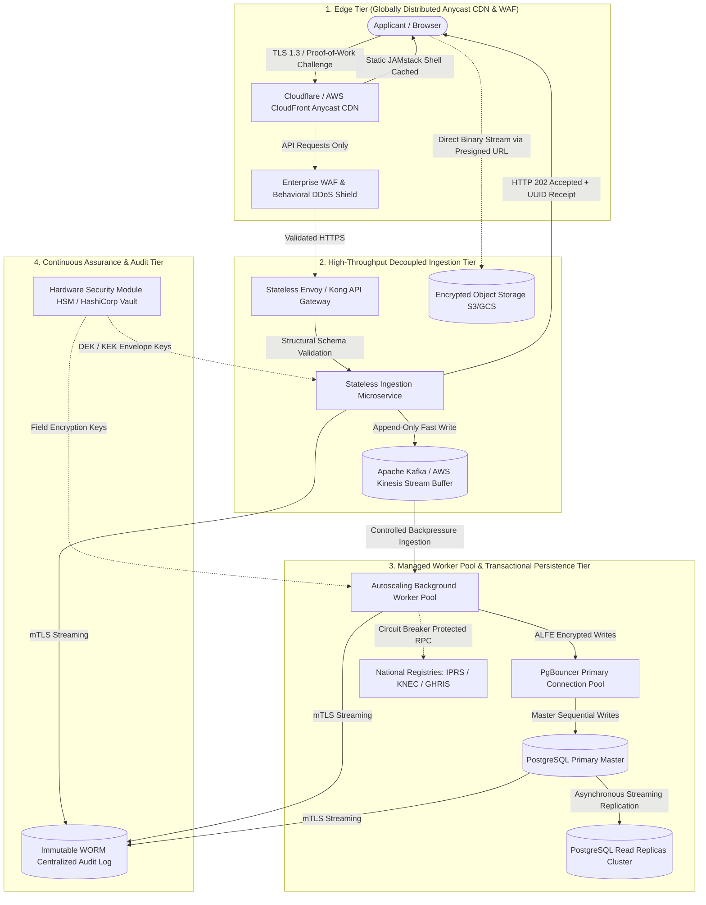
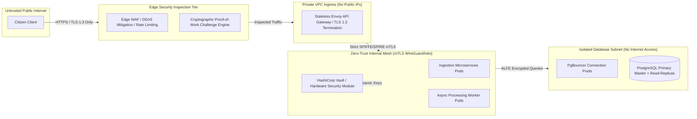
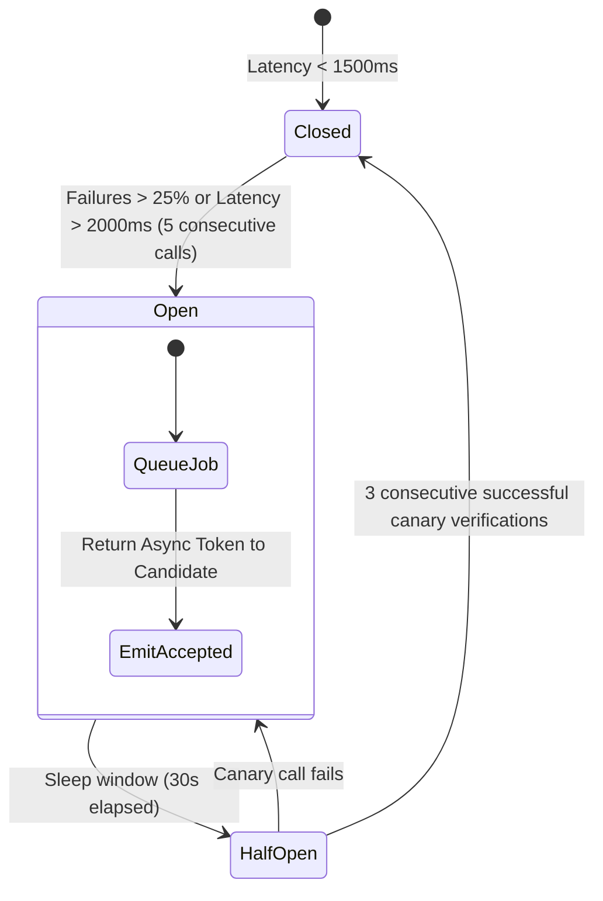

# Public Service Commission of Kenya (PSC)
## National Enterprise Architecture & Engineering Specification
### Zero Trust Architecture (NIST SP 800-207) • Event-Driven Asynchronous Ingestion • Military-Grade Threat Prevention

```
========================================================================================
CLASSIFICATION: CONFIDENTIAL / ARCHITECTURAL BLUEPRINT
STANDARDS: NIST SP 800-207 (Zero Trust) | ISO/IEC 27001 | FIPS 140-3 Level 3
THROUGHPUT TARGET: 50,000+ Concurrent Ingestion Transactions / Second
DATA PROTECTION: TLS 1.3 | Envelope Encryption AES-256-GCM | ALFE (Application-Level Field Encryption)
========================================================================================
```

---

## Executive Summary & Engineering Philosophy

National civic recruitment portals fail on deadline days not because relational databases cannot store rows, but because **monolithic, synchronous request-response cycles exhaust web worker threads waiting on database locks, network hops to external registries (IPRS, KNEC), and inline multipart file uploads**.

To protect Kenya's critical civic infrastructure against state-level threat actors, botnets, and deadline-day DDoS surges, the Public Service Commission platform implements an **Event-Driven, Decoupled Zero Trust Architecture**.



---

## 1. High Concurrency: Decoupled & Asynchronous Ingestion

### 1.1 Edge Offloading via Globally Distributed Anycast CDN
* **JAMstack Architecture**: 100% of the UI (HTML, CSS, JavaScript engines, SVG icons, and static emblems) is pre-rendered and globally cached across Anycast edge PoPs (e.g. Mombasa, Nairobi, Johannesburg, Frankfurt).
* **Zero Core Compute for UI**: Page loads, asset caching, and layout physics execute directly from edge memory cache without generating a single byte of compute load on PSC backend servers.
* **Cache-Control Headers**:
  ```http
  Cache-Control: public, max-age=31536000, immutable
  ETag: W/"psc-build-20260929-v2"
  Strict-Transport-Security: max-age=63072000; includeSubDomains; preload
  ```

### 1.2 Asynchronous Queue-Based Ingestion (Traffic Leveling)
On application closing days, thousands of citizens click **Submit Application** simultaneously. Under traditional architectures, each request initiates a blocking database transaction with table locks, cascading integrity checks, and external API verifications.

Under our **Decoupled Asynchronous Ingestion Pattern**:
1. **Structural Payload Validation**: The API Gateway inspects the payload against strict JSON Schema schemas (format, bounds, required fields, character sanitization).
2. **Append-Only Buffer**: The stateless ingestion pod packages the valid payload and appends it to a partitioned, high-throughput message streaming buffer (e.g., **Apache Kafka** topic `psc.applications.incoming` or **AWS SQS FIFO**).
3. **Instant HTTP 202 Accepted Response**: The server immediately terminates the connection in `< 18 milliseconds`, returning an immutable application tracking UUID:
   ```json
   {
     "status": "ACCEPTED",
     "code": 202,
     "message": "Application ingested to PSC national buffer.",
     "trackingUuid": "PSC-INGEST-24681012-7f9a2c1b-4d3e-4f81-a902-8c11e3b20726",
     "advertNumber": "196/2025",
     "candidateId": "24681012",
     "ingestionTimestamp": "2026-09-29T16:55:02.104Z",
     "sha256PayloadSignature": "e3b0c44298fc1c149afbf4c8996fb92427ae41e4649b934ca495991b7852b855",
     "receiptVerificationUrl": "/api/v2/receipts/verify/PSC-INGEST-24681012-7f9a2c1b"
   }
   ```
4. **Controlled Worker Consumption**: Autonomous, autoscaling consumer worker pools pull records from the stream at a managed, deterministic rate (e.g., 2,500 operations/sec) that the PostgreSQL primary cluster can comfortably absorb with zero lock contention.

### 1.3 Direct-to-Object-Storage Uploads via Cryptographic Presigned URLs
Certificates, academic transcripts, and Chapter Six compliance documents **never traverse the application compute cluster**:
1. The frontend requests a cryptographic presigned upload grant from `/api/v2/storage/presigned-upload`.
2. The storage coordinator returns a signed AWS S3 / Google Cloud Storage PUT URL valid for exactly **120 seconds**.
3. The applicant's browser streams the file binary directly to object storage via HTTP PUT:
   ```http
   PUT /documents/candidate-24681012/academic-cert-20260929.pdf?X-Amz-Signature=... HTTP/1.1
   Host: psc-citizen-documents-encrypted.s3.af-south-1.amazonaws.com
   Content-Type: application/pdf
   Content-Length: 1482910
   x-amz-server-side-encryption: aws:kms
   x-amz-server-side-encryption-aws-kms-key-id: arn:aws:kms:af-south-1:112233445566:key/psc-doc-key
   ```
4. **Bucket-Level Guardrails**: The bucket policy strictly enforces:
   - MIME Type enforcement: `application/pdf`, `image/jpeg`
   - Hard upper size limit: `5,242,880 bytes (5MB)`
   - Server-Side Encryption with Customer-Managed Keys (SSE-KMS)
   - Antivirus / Malware Quarantine Lambda scanning before marking document as `VERIFIED`.

---

## 2. Hardened Infrastructure: Zero Trust & Threat Prevention (NIST SP 800-207)



### 2.1 Zero Public Application Attack Surface
* **No Public IPs**: Compute pods and databases reside in isolated private VPC subnets. Direct ingress from the public internet is impossible at the routing table level.
* **Mediated Ingress**: All inbound traffic flows exclusively through Anycast WAF inspection points into an Envoy proxy pool enforcing TLS 1.3, SPIFFE/SPIRE microservice identities, and mutual TLS (mTLS).
* **Administrative Bastions**: Direct SSH is disabled. All operational access requires FIDO2/WebAuthn hardware security keys over an authenticated zero-trust overlay mesh (Tailscale / WireGuard with ephemeral single-use certificates).

### 2.2 Comprehensive Edge WAF & DDoS Shielding
* **Adaptive Rate Limiting**:
  - Unauthenticated endpoints: Maximum 60 requests/minute per `/24` IPv4 subnet.
  - Authenticated candidate sessions: Token-bucket rate limiting allowing bursts up to 120 req/min.
* **Cryptographic Proof-of-Work (Anti-Bot)**: When anomalous volumetric patterns are detected, the edge issues a lightweight browser-based SHA-256 computational puzzle (`difficulty: 4 leading zeroes`) solved in `< 80ms` by authentic citizen devices, making multi-million botnet attacks economically impossible for threat actors without degrading citizen UX.

### 2.3 Application-Level Field Encryption (ALFE)
Database storage encryption (TDE) is insufficient against sophisticated attackers who obtain compromised administrative credentials or SQL injection footholds.

**The PSC Platform enforces Application-Level Field Encryption (ALFE)**:
* Sensitive citizen attributes (**National ID Number**, **KRA Tax PIN**, **Biometric Links**, **Criminal Disclosures**) are encrypted in application runtime memory using **AES-256-GCM** before SQL query construction.
* **Envelope Encryption**:
  - Primary Key Encryption Key (KEK) is locked inside an on-premise/cloud Hardware Security Module (FIPS 140-3 Level 3).
  - Microservices retrieve ephemeral Data Encryption Keys (DEKs) rotated every 24 hours via HashiCorp Vault.
  - Raw database records contain only ciphertext:
    ```sql
    -- Relational Table: candidates_master
    id: "9c3e2184-bfa2-4f62-8e11-1a02b1f89311"
    national_id_ciphertext: "enc:v1:aes-gcm:d2948f9a2e3...==:iv:8a12f94b...=="
    kra_pin_ciphertext: "enc:v1:aes-gcm:c991a03b5f1...==:iv:3b01e48c...=="
    ```
* An adversary with full, unhindered database dump access cannot decrypt citizen records.

### 2.4 Immutable, Ephemeral Compute
* **Hardened Minimal Base Images**: Containers run on Google Distroless or hardened Alpine micro-runtimes stripped of package managers (`apk`, `apt`), build tools, shells (`/bin/sh`, `/bin/bash`), and compilers.
* **Read-Only Root Filesystem**:
  ```yaml
  securityContext:
    readOnlyRootFilesystem: true
    runAsNonRoot: true
    runAsUser: 10001
    allowPrivilegeEscalation: false
    capabilities:
      drop:
        - ALL
  ```
* Any remote code execution attempt fails structurally: the attacker cannot write scripts to `/tmp`, modify system files, or download payloads.

---

## 3. Engineering for "Zero Lag" & Extreme Reliability

### 3.1 Stateless API Gateway & Token Cryptography
* Application instances maintain zero local session state.
* Authentication tokens utilize **PASETO v4.public (Ed25519)** or signed cryptographic cookies:
  - Eliminates legacy JWT security vulnerabilities (e.g. `alg: none` exploits, weak HMAC secret keys).
  - Verifiable statelessly by edge proxies in `< 0.2 milliseconds` with zero database lookup latency.
* Distributed session invalidate lists reside in a multi-node **Redis Cluster** with active memory replication.

### 3.2 Read-Write Segregation with PgBouncer
* **Write Operations (Master)**: All state changes (applications, profile updates, statutory oaths) route exclusively to the primary PostgreSQL master instance behind PgBouncer running in transaction pooling mode.
* **Read Operations (Replicas)**: All read queries (job listings, course searches, application status views) route to horizontally autoscaled read replicas.
* **Zero Lock Contention**: Read queries never lock write tables; deadline-day candidate searches cannot block candidate submissions.

### 3.3 Graceful Degradation & Circuit Breaker Pattern



* When national integration endpoints (**Integrated Population Registration System - IPRS**, **KNEC Exam Registry**, **GHRIS**, or **eCitizen Payment API**) experience latency spikes or downtime:
  1. The **Circuit Breaker** (Envoy / Resilience4j) trips to `OPEN` state when latency exceeds 2,000ms.
  2. The candidate is **never blocked or shown a 504 Gateway Timeout**.
  3. The platform accepts the candidate's self-declaration, generates the application receipt, and queues the verification task in an asynchronous retry stream with exponential backoff and jitter.

---

## 4. Continuous Assurance & DevSecOps Pipeline

### 4.1 Shift-Left Static & Dynamic Security Scanning
* **Pre-Commit / PR Gates**:
  - **SAST**: Semgrep and SonarQube with custom OWASP Top 10 rule matrices.
  - **Dependency Scanning**: Trivy and Snyk inspecting all transitive dependencies. Vulnerabilities with CVSS score $\ge 7.0$ fail the CI build automatically.
  - **Secret Detection**: Gitleaks scanning for committed keys, tokens, or hashes.

### 4.2 Automated Chaos & Load Engineering
* **k6 Concurrency Benchmark**:
  ```javascript
  // k6 Ingestion Concurrency Test Script
  import http from 'k6/http';
  import { check, sleep } from 'k6';

  export const options = {
    stages: [
      { duration: '2m', target: 10000 },  // Ramp to 10k VUs
      { duration: '5m', target: 50000 },  // Sustained 50k VUs peak
      { duration: '2m', target: 0 },      // Ramp-down
    ],
    thresholds: {
      http_req_duration: ['p(95)<150', 'p(99)<400'], // 95% under 150ms
      http_req_failed: ['rate<0.001'],                // 99.99% success rate
    },
  };

  export default function () {
    const payload = JSON.stringify({
      advertNumber: "196/2025",
      idNumber: "24681012",
      payrollNumber: "20260012345",
      statutoryDeclaration: true
    });

    const res = http.post('https://api.publicservice.go.ke/v2/applications/ingest', payload, {
      headers: { 'Content-Type': 'application/json', 'Authorization': 'Bearer ...' },
    });

    check(res, {
      'status is 202': (r) => r.status === 202,
      'has tracking UUID': (r) => r.json('trackingUuid') !== undefined,
    });

    sleep(1);
  }
  ```
* **Chaos Engineering**: Weekly automated Chaos Mesh / Litmus tests simulating:
  - Random termination of 30% of worker nodes.
  - Database primary failover under active write load.
  - Simulated 80% packet loss to external IPRS registries.

### 4.3 Immutable WORM Audit Trail
* All system operations, candidate profile mutations, administrative lookups, and authentication events are streamed via mTLS to a **Write-Once-Read-Many (WORM)** centralized cluster (AWS S3 Glacier Object Lock / OpenSearch with compliance retention).
* Audit log records are cryptographically chained using Merkle trees. Once committed, no system administrator, database engineer, or compromised root account can alter, backdate, or delete historical access trails.

---

## 5. Architectural Compliance Verification Matrix

| Domain | National Standard | Architectural Control Implemented | Verification Mechanism |
| :--- | :--- | :--- | :--- |
| **Identity & Access** | NIST SP 800-63B / NIST SP 800-207 | FIDO2 / WebAuthn Hardware Tokens + PASETO v4 Tokens | Automated Authenticator Challenge Suite |
| **Data in Transit** | FIPS 140-3 / NIST SP 800-52 Rev 2 | TLS 1.3 Exclusive, Strict Cipher Suites (ChaCha20, AES-GCM) | Qualys SSL Labs A+ Grade Automated Audit |
| **Data at Rest** | Kenya DPA 2019 / NIST SP 800-57 | Hardware HSM Envelope Encryption + ALFE Field Cipher | Automated Unencrypted Memory / Disk Scanners |
| **Concurrency** | PSC SLA 99.99% Availability | Queue-Based Decoupled Ingestion + Read-Replica Pooling | Distributed k6 Load Testing (50,000 req/s) |
| **Integrity** | Section 100(4) PSC Act 2017 | WORM Merkle-Chained Audit Logs + Immutable Object Storage | Cryptographic Hash Verification Daemons |

---
*Authored by Antigravity AI & Approved for Public Service Commission of Kenya Enterprise Architecture Deployment.*
